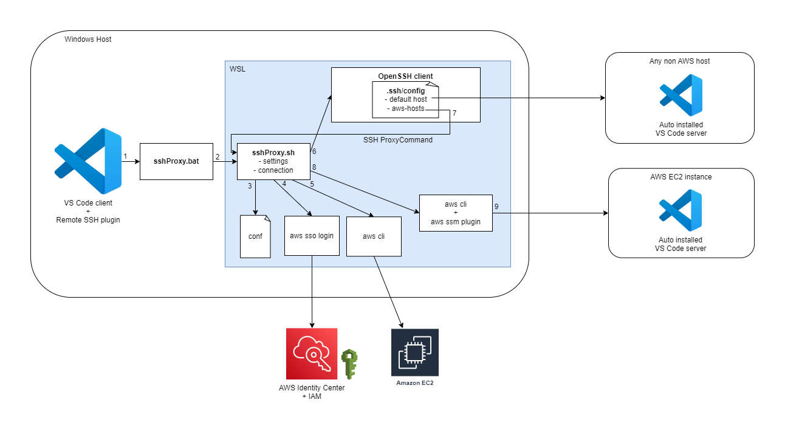
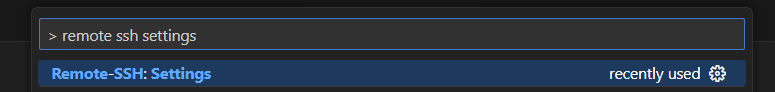
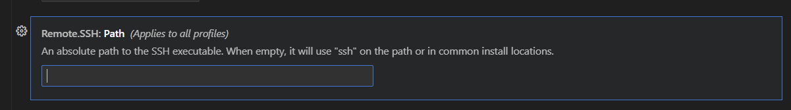
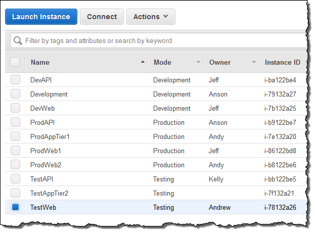
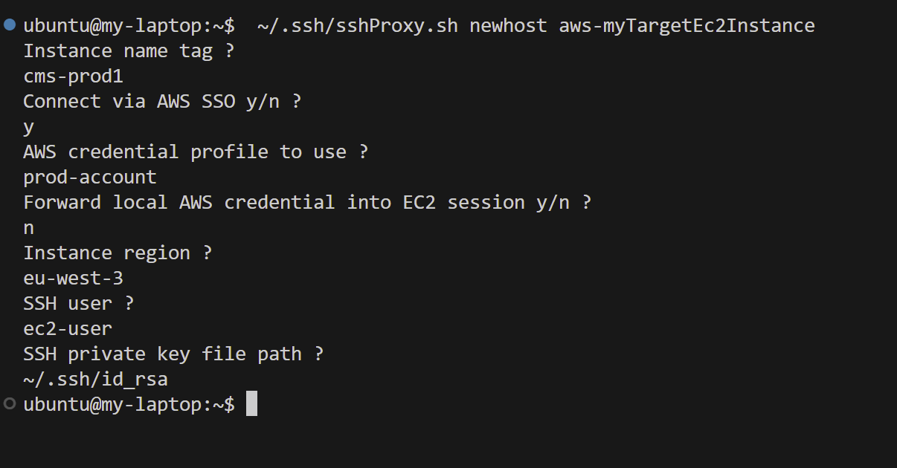
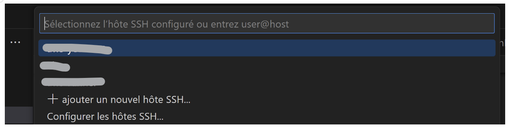

# ynpact-ssh-ssm-proxy
Ynpact SSH-SSM-Proxy tool allow to use VS Code remote SSH extension through a AWS SSM Session Manager SSH session **to connect to and manage remote EC2 hosts in a painlessly manner**.

While you'll find on most blog solutions that allow to connect to remote EC2 instance using SSM, none of these are generic enough to allows a convenient daily use. With this proxy script, **you can administrate at scale a wide variety of EC2 instances**, located onto different AWS account and region, using different SSH key/user, AWS authentication methods and AWS credentials profiles.

It also provide a **unique feature that forward and inject locally AWS credential** (gained via AWS SSO/IdentityCenter or static key) into the remote EC2 instance, so that you still can manage the authorization per user even in the EC2 instance, where by default, the EC2 instance role  apply (see ore on {blog post note}).

## Features:
- Enhanced Security and logging for EC2 instances SSH session with AWS SSM Session Manager.
  **Connect to EC2 instances located in private subnet with inbound SSH port closed**
- Enhanced remote file system integration in VS Code when using AWS credentials gained by SSO. **It will not popout the broswer for SSO login multiple time**
- Connect to host using friendly name instead of ID that may change over time. **You can forget about looking for instanceIDs**
- Use AWS credential locally gained by SSO within the EC2 instances. **Once connected into the EC2 instances, users act as themselve, with their own set of authorization, not as the EC2 instance profile role**
- for each host, allow to configure credential profile, region, user and SSH key to use and activate or not current credential fowarding into the EC2 instance. **If you have a huge list of EC2 instance to connect to, locatad in different account, region and using different credential profile, this tool is for you, a you won't have to insert all that EC2 host specific conf into your ssh config file with a ProxyCommand line you can not refactor**

## How it works

See our blog post to understand the connection flow here : {link}

## Set Up
You can install it on any operating system, but on windows you must perform those step in your default WSL distribution with its default user (appart from step 4 and 5 that must be done in the Windows host).
1) Install the last AWS CLI and the AWS SSM Plugin into your Mac/Linux/WSL (not in Windows). Instruction available in AWS documentation :
   - [AWS CLI](https://docs.aws.amazon.com/cli/latest/userguide/getting-started-install.html)
   - [AWS SSM Plugin](https://docs.aws.amazon.com/systems-manager/latest/userguide/session-manager-working-with-install-plugin.html)
2) Install VS Code Remote SSH extension in the extension tab of VS Code. [See documentation here.](https://code.visualstudio.com/docs/remote/remote-overview)
3) Download the [SSH Proxy Script](src/sshProxy.sh) and save it into your default user .ssh directory in your Mac/Linux/WSL distribution.
4) Update your SSH config file (~/.ssh/config) into your default user directory in your Mac/Linux/WSL by adding the following lines :
```
host i-* mi-*
  StrictHostKeyChecking no
  ProxyCommand bash -ci "/home/<user>/.ssh/sshProxy.sh cnx %h %p"
```
5) [Windows only] When you use VS Code in Windows, the client runs into Windows and not WSL. As the tool, SSH & AWS settings runs into WSL, a script is needed to bridge into WSL.
Write a .bat script thatt lauch the SSH proxy script of step 2. Save this script in your home directory in Windows under the .ssh folder. **Do not use "~" in the script path but the full home directory of your WSL default user.**
```
C:\Windows\system32\wsl.exe bash -ic '<home-directory-in-wsl>/.ssh/sshProxy.sh %*'
```
6) Using the command palette of VS Code (Ctrl+Maj+P) and searching for "remote ssh setting", update the Remote SSH extension **Path** parameter in VS Code to use
- Windows: the path to the .bat script you created in step 4.
- Linux/Mac: ~/.ssh/sshProxy.sh



## Configuration
### Add, edit or remove a Host:
This command allows you to create, edit or delete a host configuration, identified by an alias you can choose. The alias name musts start with "aws-"
```
~/.ssh/sshProxy.sh newhost|edithost|rmhost {alias}
```
Run it and for newhost or edithost command option, answer the script prompts :
- Instance name tag : enter your target EC2 instance name-tag value. The instance name appears in your AWS EC2 console : when you list the instances, it's the Name column.

- Connect via AWS SSO y/n : type "y" to gain AWS credential using your corporate IdP and AWS Identity Center (AWS SSO)
- AWS credential profile to use : enter the name of the AWS credential profile to use to connect to the target EC2 instance (you must configure this profile beforhand). See "operator credential requirement" section to ensure this profile will authorize all action needed by the script
- Forward local AWS credential into EC2 session y/n : type "y" to forward/inject local credential that are used to connect to the EC2 instance into the remote SSH session. Otherwise, the remote session will use the EC2 instance profile IAM role.
- Instance region : enter the AS region where the target EC2 instance is running
- SSH user : enter the SSH user to use to connect to the EC2 instane. This depend the EC2 instance distribution. It might be ec2-user, ubuntu or any other user (consult your target EC2 instance AMI documenation).
- SSH private key file path : enter the path to the private SSH key to use to connect to the instance. The corresponding public key must be declared into the .ssh/authorized_keys file of your target instance. Without key, the connection via the Remote SSH extension can not work.

Example adding an alias **"aws-myTargetEc2Instance"** to connect to the EC2 instance named **"cms-prod1"** and located in the eu-west-3 region, with no credential forwarding, using SSO profile "prod-account" for AWS authentication, Linux user "ec2-user" and ~/.ssh/id_rsa private key.


## Usage
### Pre-requisite
The operator using the tool must have the following permissions :
- can describe EC2 instances on target region and account (to retrieve instanceId based on instance name)
- can start SSM section onto the target ECS-instance(s) using the documents "AWS-StartNonInteractiveCommand" (to optionnaly auto-install SSH public key) and "AWS-StartSSHSession" (to connect to the EC2 instance)

The EC2 instances you would like to connect to must :
- have the SSM agent installed, configured and running (most AMI have it all setup by default)
- have a instance profile role that allows interacting with the SSM service
- if in a private subnet, this subnets must have VPC endpoint toward the SSM service

See AWS pre-requisite for using AWS SSM sessions.
### Connect to a Pre-configured Host:
In VS Code's command palette, select "Remote SSH: Connect to Host," and enter the host's alias choosen when creating a new host.
### Connect to a Non-configured Host:
If you need to connect to a host that hasn't been previously configured, and that you don't plan to connect to often, use the command palette in VS Code to select "Connect to Remote Host." and enter the host information in the format :

{hostname}.{sso|static}.{aws-profile}.{forward-cred-y|n}.{aws-region}.{ssh-user}.{ssh-private-key-file-path}.

Note: the private key MUST be in the .ssh directory of current WSL/Linux/MacOS user
### Bookmarking hosts
Into your SSH config file of your windows host C:\Users\\{username}\\.ssh\config, you can add the host you connect to frequently so it appears in VS Code when you use the command palette to connect to a remote host : 
```
Host aws-host
    HostName aws-host
```


